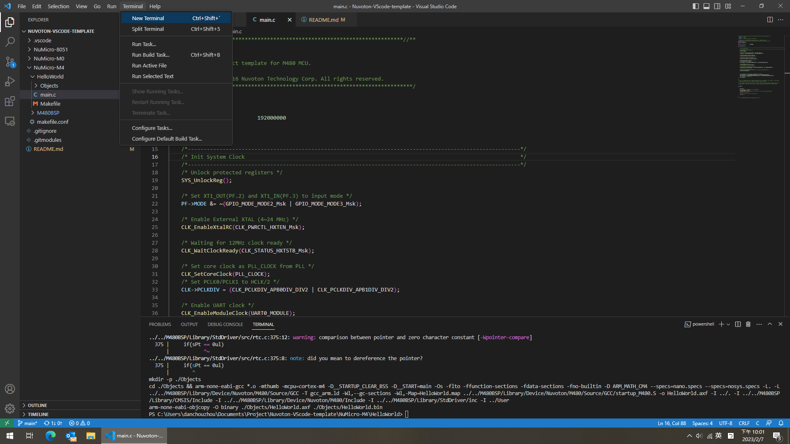

# Nuvoton Visual Studio Code Template
## Usage
### To clone this project
This project work with submodule from Nuvoton corporation. You need to initialize submodules by passing ``--recurse-submodules`` to the ``git clone`` command.
```
git clone https://github.com/danchouzhou/Nuvoton-VScode-template.git --recurse-submodules
```

### Build tools
#### Windows users
Since we use VScode ``setting.json`` provide the build environment, only the execution binary need to be download (without installing). Download the following files, extract to the path ``C:\Users\"Your user name"\BuildTools\Windows`` which specific in ``.vscode/setting.json``.
- [gcc-arm-none-eabi-10.3-2021.07-win32.zip](https://developer.arm.com/downloads/-/gnu-rm)
- [xpack-windows-build-tools-4.3.0-1-win32-x64.zip
](https://github.com/xpack-dev-tools/windows-build-tools-xpack/releases/tag/v4.3.0-1)
#### Linux users
- [gcc-arm-none-eabi-10.3-2021.07-x86_64-linux.tar.bz2](https://developer.arm.com/downloads/-/gnu-rm)
```
mkdir -p ~/BuildTools/Linux/
tar jxvf gcc-arm-none-eabi-10.3-2021.07-x86_64-linux.tar.bz2 -C ~/BuildTools/Linux/
```
- GNU Make should be installed.
```
sudo apt install make
```
### Build the template
If you want to build the target for Nuvoton M480 series for example. Open a terminal inside the VScode.
```
cd NuMicro-M4/HelloWorld
```
Simply ``make``. ``HelloWorld.bin`` should be inside the ``Objects`` folder.
```
make
```
### Rebuild
```
make clean
make
```


### Create your own project from this template
1. Add BSP submodule from [OpenNuvoton](https://github.com/OpenNuvoton). For example:
```
git submodule add https://github.com/OpenNuvoton/M480BSP.git NuMicro-M4/M480BSP
```
2. Edit ``CORTEX_M``, ``BASE``, ``DEVICE`` in the ``makefile.conf``.

## Reference
- [A Simple Makefile Tutorial](https://www.cs.colby.edu/maxwell/courses/tutorials/maketutor/)
- [Makefile Tutorial By Example](https://makefiletutorial.com/)
- [Git - Submodules](https://git-scm.com/book/en/v2/Git-Tools-Submodules)
- [Set global $PATH environment variable in VS Code - Stack Overflow](https://stackoverflow.com/questions/43983718/set-global-path-environment-variable-in-vs-code)